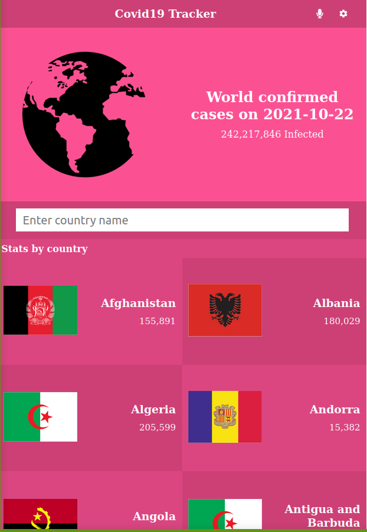
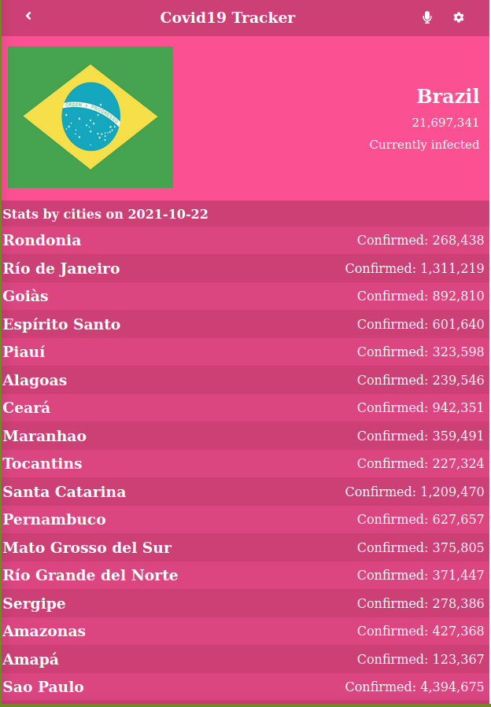

# BookStore
* This project was created using React and Redux, it allows you to keep track of the covid-19 pandemic by country on the current date. You can check information by contry and some countries contain information for its cities. The App contain a easy way to find a country with a search input, it;s a single page aplication that has 2 page components routed by the main App component. The app desing is ment for mobile devices only.

Designed by: [Nelson Sakwa on Behance](https://www.behance.net/sakwadesignstudio)

Flags were took from website [https://www.worldometers.info](https://www.worldometers.info)

 

## Built With

- Html, Javascript, CSS
- Webpack
- React JS
- Redux
- Developed in VSCode

## Link

Get a live preview of the project on this link  

- Link: [Live-Preview](https://agitated-pike-942a36.netlify.app/)

## Setup 
### clone repository
```bash
$ git clone git@github.com:JbirdL86/covid19-tracking.git
```
### Start Project
```bash
$ cd Bookstore 
-Install node_modules
-run npm install
$ npm start
```

### Author 🤝:
* Juan Luis Gonzalez 
- Github: [@githubhandle](https://github.com/JbirdL86)
- Twitter: [@twitterhandle](https://twitter.com/JuanLui06498455)
- Linkedin: [linkedin](https://www.linkedin.com/in/juan-luis-0551921aa/)

## 🤝 Contributing

Contributions, issues, and feature requests are welcome!

## Acknowledgments

- Microverse program ⚡
- Our standup team 🏹
- Nelson Sakwa on Behance
